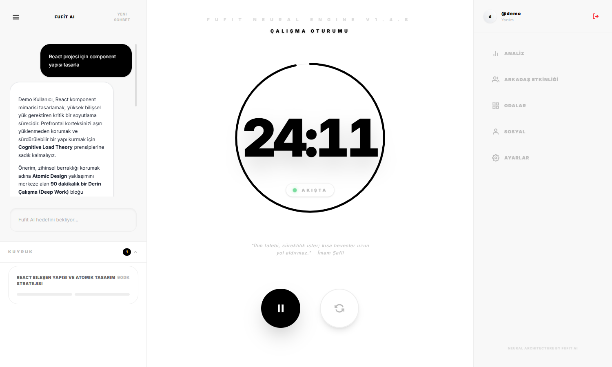
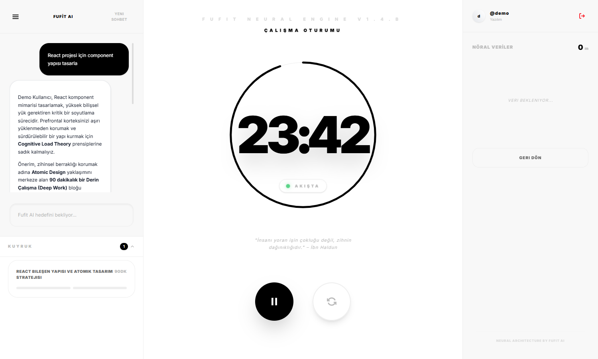

<div align="center">


# FoClock AI

**Nöral Odak Motoru** · Neural Beta 1.5.E

Pomodoro'yu bilişsel bilim temelleriyle birleştiren, yapay zekâ destekli odak yönetimi platformu.

[](https://react.dev)
[](https://www.typescriptlang.org)
[](https://vitejs.dev)
[](https://tailwindcss.com)
[](https://supabase.com)
[](https://ai.google.dev)

</div>

<div align="center">
  
  
</div>

---

## Nedir?

Çoğu Pomodoro uygulaması herkese aynı 25 dakikayı verir. FoClock AI bunun yerine
**görevin kapsamını** ve **kişinin odak profilini** birlikte değerlendirip süreyi
ona göre belirler.

Kullanıcı ne üzerinde çalışacağını doğal dille anlatır; Fufit AI görevi sınıflandırır
(MICRO → MARATHON), kişinin geçmiş oturumlarından çıkardığı alışkanlıklarla birleştirir
ve gerekçesiyle birlikte bir plan önerir.

Planlama sekiz psikolojik ilke üzerine kurulu: Bilişsel Yük Teorisi, Ultradian Ritim,
Zeigarnik Etkisi, Yerkes–Dodson Yasası, Ego Tükenmesi, Aralıklı Tekrar, Flow Giriş
Gecikmesi ve Parkinson Yasası.

---

## Özellikler

### Yapay zekâ planlama

Doğal dil girdisinden görev planı üretir. `user_ai_memory` tablosunda biriken
çıkarımlar sonraki planlamalara bağlam olarak beslenir; sistem kullanıldıkça
kullanıcıyı tanır.

### Odak protokolleri

| Protokol | Blok | Kime |
|----------|------|------|
| Klasik Pomodoro | 25 / 5 dk | Odaklanma alışkanlığı yeni oturanlar |
| Genişletilmiş | 30–35 / 8–10 dk | 30–45 dk tutabilenler |
| Flowtime | 45–52 / 10–17 dk | Güvenilir odak pencereleri olanlar |
| Ultradian Ritim | 90 / 20 dk | Derin çalışmaya hazır olanlar |
| Deep Work | 90–120 / 25–30 dk | Hiperfokus profili (zorunlu reset) |

### Sosyal katman

- **Arkadaşlık** — kullanıcı adıyla arama, istek gönderme ve kabul
- **Canlı durum** — arkadaşların aktif oturumlarını ve son görülme bilgisini izleme
- **Birlikte Çalış** — iki kişi, bağımsız timer'lar, eş zamanlı oturum
- **Odalar** — 8 karakterli kodla katılınan, en fazla 15 üyeli ortak timer

### Analitik

Gün / hafta / ay / yıl kırılımında oturum geçmişi, görev bazlı performans ve
tamamlanan blok özetleri.

### Arayüz

Açık ve koyu tema, Türkçe ve İngilizce dil desteği, hesap açmadan denenebilen
demo modu.

---

## Mimari

```
┌──────────────────────── TARAYICI ────────────────────────┐
│  React 19 + TypeScript (Vite 6) · Tailwind 4             │
│  App.tsx — tek sayfa, router yok                         │
│                                                          │
│   services/supabase.ts        services/geminiService.ts  │
└────────────┬────────────────────────────┬────────────────┘
             │ anon key + JWT             │ JWT
             │                            │
      ┌──────▼──────────┐      ┌──────────▼─────────────┐
      │    Supabase     │      │  /api/gemini           │
      │  Postgres + RLS │      │  Vercel Serverless     │
      │  Auth, Realtime │      │  · JWT doğrulama       │
      └─────────────────┘      │  · model allowlist     │
                               │  · rate limit          │
                               └──────────┬─────────────┘
                                          │ GEMINI_API_KEY
                                          │ (yalnızca sunucuda)
                               ┌──────────▼─────────────┐
                               │   Google Gemini API    │
                               └────────────────────────┘
```

Gemini anahtarı **hiçbir zaman** istemciye inmez. Tüm yapay zekâ çağrıları,
oturum JWT'sini doğrulayan bir serverless proxy üzerinden geçer.

Ayrıntı için [`docs/ARCH.md`](docs/ARCH.md).

---

## Güvenlik

Proje kapsamlı bir güvenlik denetiminden geçti. Bulgular, istismar senaryoları ve
kapatılma gerekçeleri [`docs/SECURITY.md`](docs/SECURITY.md) dosyasında.

| Alan | Önlem |
|------|-------|
| API anahtarı | Serverless proxy; `VITE_` önekli sır kullanılmaz, CI her build'de paketi sır için tarar |
| AI endpoint | Supabase JWT zorunlu, model allowlist, kullanıcı başına rate limit, payload sınırı |
| Veritabanı | Tüm tablolarda RLS, taraf değişmezliği trigger'ları, arkadaşlık kontrolü sunucu tarafında |
| Yetkilendirme | `SECURITY DEFINER` fonksiyonlarında PUBLIC EXECUTE kapalı, yetkiler açıkça atanmış |
| Şifre | En az 12 karakter, büyük/küçük harf ve rakam — hem istemcide hem Supabase Auth'ta |
| XSS | Yapay zekâ çıktısı DOMPurify ile sanitize edilir (`p`, `strong`, `br`, `em`) |
| HTTP | `script-src 'self'` CSP, HSTS, `X-Frame-Options: DENY`, Referrer-Policy |

Güvenlik açığı bildirimi için [`.github/SECURITY.md`](.github/SECURITY.md).

---

## Kurulum

### Gereksinimler

- Node.js 20+
- Supabase projesi
- Google Gemini API anahtarı

### Ortam değişkenleri

```bash
cp .env.local.example .env.local
```

```bash
# İstemciye gömülür — yalnızca herkese açık olabilecek değerler
VITE_SUPABASE_URL=https://YOUR_PROJECT.supabase.co
VITE_SUPABASE_ANON_KEY=your_publishable_key_here

# Yalnızca sunucu tarafı — VITE_ öneki YOK
GEMINI_API_KEY=your_gemini_api_key_here
```

> **Uyarı:** Vite, `VITE_` önekli her değişkeni istemci paketine düz metin olarak
> gömer. Gizli kalması gereken hiçbir değeri bu önekle tanımlamayın.

### Çalıştırma

```bash
npm install
```

Arayüz ve Supabase için:

```bash
npm run dev
```

Yapay zekâ çağrıları `/api/gemini` serverless fonksiyonundan geçer ve Vite dev
sunucusu serverless fonksiyon çalıştırmaz. Yapay zekâyı yerelde denemek için:

```bash
npx vercel dev
```

### Veritabanı

Supabase SQL Editor'da sırasıyla çalıştırın:

| # | Dosya | İçerik |
|---|-------|--------|
| 001 | `001_initial_schema.sql` | `profiles`, `friend_requests`, `active_sessions` ve RPC'ler |
| 002 | `002_schema_cowork_rooms.sql` | `sessions`, `rooms`, `room_members`, `co_work_pairs`, `pair_invites` |
| 003 | `003_schema_presence.sql` | `last_seen_at` ve heartbeat |
| 004 | `004_schema_ai_chats.sql` | `ai_conversations`, `ai_messages` |
| 005 | `005_schema_user_ai_memory.sql` | `user_ai_memory` |
| 006 | `006_fix_rls.sql` | RLS özyineleme düzeltmesi |
| 007 | `007_cleanup_data.sql` | Test verisi temizliği (opsiyonel) |
| 008 | `008_security_hardening.sql` | Oda kodu 8 karakter, profil RPC sıkılaştırma |
| 009 | `009_authz_hardening.sql` | Taraf değişmezliği, arkadaşlık kontrolü, PUBLIC EXECUTE kaldırma |

Ayrıntı: [`docs/README-SQL.md`](docs/README-SQL.md)

### Deploy

Vercel'de repoyu içe aktarın ve şu ortam değişkenlerini tanımlayın:

- `GEMINI_API_KEY` — **Sensitive** olarak işaretleyin
- `VITE_SUPABASE_URL`
- `VITE_SUPABASE_ANON_KEY`

`vercel.json` güvenlik başlıklarını ve SPA yönlendirmesini zaten içerir.

---

## Proje yapısı

```
api/
  gemini.ts               Gemini proxy — JWT doğrulama, allowlist, rate limit
src/
  App.tsx                 Tek sayfa uygulama
  services/
    supabase.ts           Supabase istemcisi
    authService.ts        Kayıt, giriş, oturum, şifre politikası
    geminiService.ts      Yapay zekâ çağrıları, prompt'lar, DOMPurify sanitizasyonu
    friendService.ts      Arkadaşlık akışı
    pairService.ts        Birlikte Çalış
    roomService.ts        Odalar
    presenceService.ts    Son görülme heartbeat'i
    chatService.ts        Sohbet geçmişi
    userMemoryService.ts  Yapay zekâ belleği (KVKK: clearAllInsights)
    calendarService.ts    Google Takvim bağlantısı
  locales/                TR ve EN çeviriler
  types/                  Paylaşılan tipler
supabase/migrations/      Sıralı SQL migration'ları
docs/                     Mimari, ürün, güvenlik ve sürüm dokümanları
```

---

## Dokümantasyon

| Dosya | İçerik |
|-------|--------|
| [`docs/ARCH.md`](docs/ARCH.md) | Mimari, veri akışı, tablo şemaları |
| [`docs/PRODUCT_SPEC.md`](docs/PRODUCT_SPEC.md) | Ürün gereksinimleri ve davranış kuralları |
| [`docs/SECURITY.md`](docs/SECURITY.md) | Güvenlik denetim raporu |
| [`docs/CHANGELOG.md`](docs/CHANGELOG.md) | Sürüm geçmişi |
| [`docs/LOCAL_TEST.md`](docs/LOCAL_TEST.md) | Yerel kurulum ve test senaryoları |
| [`docs/DEPLOY_NOTES.md`](docs/DEPLOY_NOTES.md) | Deploy notları |
| [`docs/PROMPT_TEST_SCENARIOS.md`](docs/PROMPT_TEST_SCENARIOS.md) | Prompt test senaryoları |
| [`docs/ELEVATOR_PITCH.md`](docs/ELEVATOR_PITCH.md) | Kısa tanıtım |

---

## Sürüm

**Neural Beta 1.5.E** — sürüm bilgisi tek kaynaktan yönetilir: [`src/version.ts`](src/version.ts).

---

## Telif

Copyright © 2026 Cihan Enes Durgun. Tüm hakları saklıdır.

Bu depo, kaynak kodu **görüntüleme ve inceleme** amacıyla herkese açık tutar.
Açık kaynak lisansı verilmemiştir: kodun tamamının veya bir bölümünün
kopyalanması, değiştirilmesi, dağıtılması ya da herhangi bir işte kullanılması
yazılı izin olmaksızın serbest değildir.

İzin ve iş birliği için iletişime geçebilirsiniz.
